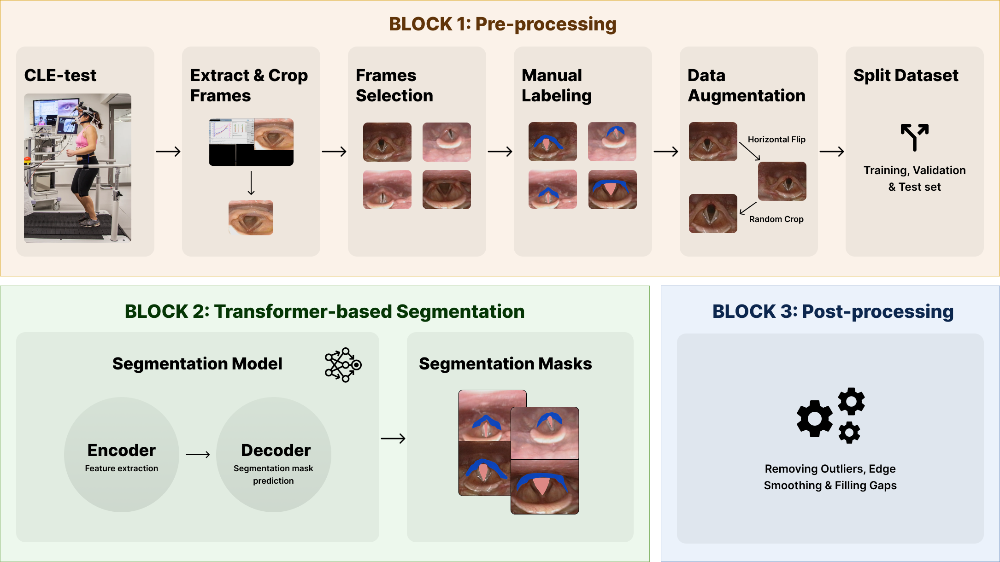

# LarynxFormer

This repository contains the code for the LarynxFormer framework for pre-processing, segmentation and post-processing of laryngeal images.
The goal of the model is to segment the vocal cords and supraglottis in the larynx.
The purpose of the study is to move towards a more objective diagnostic tool for the assessment of exercise-induced laryngeal obstruction (EILO). The data used for training the transformer-based model is obtained from continuos laryngoscopy exercise-tests (CLE-tests).

## Architecture of the LarynxFormer Framework

## Usage

Within the `src/`-folder, all necessary files can be found.

### BLOCK 1: Pre-processing

#### Extract & Crop Frames

Done using the `video_frame_extraction.py` script. This files contains the necessary functions to crop and extract frames from a video file.

#### Frames Selection

Manual step

#### Manual labeling

Manual step using a labeling tool (e.g. Label Studio)

### Data Augmentation

After manual labeling, the data needs to be pre-processed further before it can be used for training. First, `preprocess_masks()` in `preprocessing.py` is used to convert the labeled data into a dataset of images and their corresponding masks.

The `dataset.py`-file contains the class for creating a DataLoader for loading the dataset, making it ready for training and for applying data augmentation.

#### Split Dataset

The `split_dataset()` function in `preprocessing.py` is used to split the dataset into training, validation and test sets.

### BLOCK 2: Transformer-based Segmentation

After the pre-processing, the model is trained using a transformer-based segmentation model. The `transformer_training.ipynb`-notebook contains the code for training and evaluationg the model (and also the pre-processing steps).

### BLOCK 3: Post-processing

The `postprocessing.py`-file contains the necessary functions for post-processing the segmentation results.
